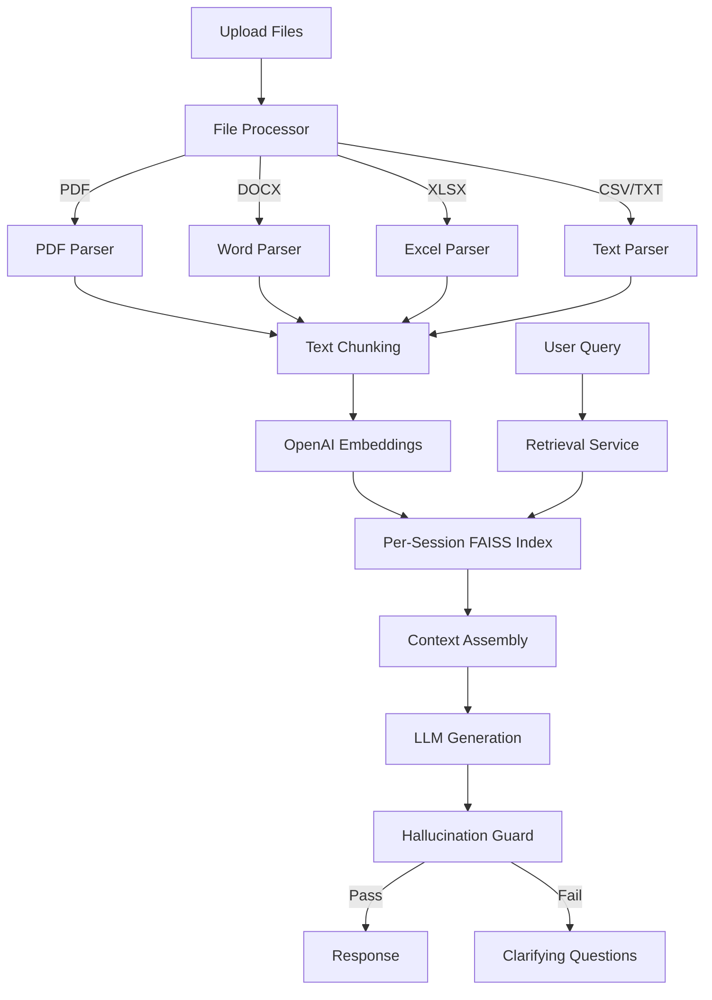

# Agentic Document QA


Conversational document Q&A agent with per-session FAISS vector indexing, multi-format file upload (PDF, DOCX, XLSX, CSV, TXT, JSON), streaming SSE responses, hallucination guard, and an optional Streamlit UI.

---

## Architecture



---

## Features

- **Per-session FAISS indexing** -- each upload creates its own searchable vector index
- **Multi-format file support** -- PDF, DOCX, XLSX, XLS, CSV, TXT, JSON
- **Conversational memory** -- session history with configurable message limits
- **Hallucination guard** -- groundedness scoring with automatic fallback to clarifying questions
- **SSE streaming** -- real-time token-by-token responses via Server-Sent Events
- **Two-level caching** -- L1 in-memory (cachetools TTL) + L2 Redis (optional)
- **S3 session persistence** -- save and restore sessions from S3 for durability
- **Streamlit UI** -- interactive frontend for local development and demos
- **Token budget management** -- tracks input/output tokens with configurable warnings

---

## Tech Stack

| Component | Technology |
|-----------|------------|
| Framework | FastAPI |
| LLM | OpenAI GPT-4o-mini |
| Embeddings | text-embedding-3-small |
| Vector Store | FAISS (per-session) |
| File Parsing | pdfplumber, python-docx, openpyxl |
| UI | Streamlit (optional) |
| Streaming | SSE (sse-starlette) |
| Caching | cachetools (L1) + Redis (L2) |

---

## Quick Start

```bash
git clone https://github.com/AniruddhaPKawarase/agentic-doc-qa.git
cd agentic-doc-qa
python -m venv venv
source venv/bin/activate      # Windows: venv\Scripts\activate
pip install -r requirements.txt
cp .env.example .env
# Edit .env with your OpenAI API key
python main.py
```

The server starts on `http://localhost:8006` by default.

To launch the Streamlit UI instead:

```bash
streamlit run streamlit_app.py
```

---

## API Reference

| Method | Endpoint | Description |
|--------|----------|-------------|
| `POST` | `/api/upload` | Upload files to a session |
| `POST` | `/api/chat` | Ask a question (blocking) |
| `POST` | `/api/chat/stream` | Ask a question (SSE streaming) |
| `GET` | `/api/sessions` | List all sessions |
| `GET` | `/api/sessions/{id}` | Get session details |
| `DELETE` | `/api/sessions/{id}` | Delete a session |
| `GET` | `/health` | Health check |

### Examples

**Upload files:**

```bash
curl -X POST http://localhost:8006/api/upload \
  -F "files=@report.pdf" \
  -F "files=@specs.docx" \
  -F "session_id=my-session-01"
```

**Ask a question:**

```bash
curl -X POST http://localhost:8006/api/chat \
  -H "Content-Type: application/json" \
  -d '{
    "session_id": "my-session-01",
    "query": "What are the key findings in the report?"
  }'
```

**Stream a response (SSE):**

```bash
curl -N -X POST http://localhost:8006/api/chat/stream \
  -H "Content-Type: application/json" \
  -d '{
    "session_id": "my-session-01",
    "query": "Summarize the specifications document."
  }'
```

---

## Streamlit UI

The included Streamlit app provides a chat-based interface for uploading documents and asking questions interactively.

```bash
streamlit run streamlit_app.py
```

The UI connects to the FastAPI backend and supports file upload, conversation history, and streaming responses out of the box.

---

## Project Structure

```
agentic-doc-qa/
├── main.py                     # FastAPI application entry point
├── config.py                   # Configuration & environment variables
├── streamlit_app.py            # Streamlit UI frontend
├── requirements.txt            # Python dependencies
├── .env.example                # Environment variable template
├── LICENSE                     # MIT License
├── models/
│   ├── __init__.py
│   └── schemas.py              # Pydantic request/response models
├── routers/
│   ├── __init__.py
│   ├── chat.py                 # /api/chat and /api/chat/stream
│   ├── converse.py             # Conversation management
│   ├── sessions.py             # /api/sessions CRUD
│   └── upload.py               # /api/upload file handling
├── services/
│   ├── __init__.py
│   ├── cache_service.py        # L1 + L2 caching layer
│   ├── embedding_service.py    # OpenAI embedding calls
│   ├── file_processor.py       # Multi-format file parsing
│   ├── generation_service.py   # LLM prompt assembly & generation
│   ├── hallucination_guard.py  # Groundedness scoring & rollback
│   ├── index_service.py        # FAISS index management
│   ├── retrieval_service.py    # Vector similarity search
│   ├── session_service.py      # Session lifecycle management
│   └── token_tracker.py        # Token usage tracking
├── s3_utils/
│   ├── __init__.py
│   ├── client.py               # S3 client wrapper
│   ├── config.py               # S3 configuration
│   ├── helpers.py              # S3 helper functions
│   └── operations.py           # S3 CRUD operations
└── tests/
    ├── __init__.py
    └── test_s3_docqa.py        # S3 integration tests
```

---

## Environment Variables

| Variable | Default | Description |
|----------|---------|-------------|
| `DOCQA_HOST` | `0.0.0.0` | Server bind address |
| `DOCQA_PORT` | `8006` | Server port |
| `OPENAI_API_KEY` | -- | OpenAI API key (required) |
| `OPENAI_CHAT_MODEL` | `gpt-4o-mini` | Chat completion model |
| `OPENAI_EMBEDDING_MODEL` | `text-embedding-3-small` | Embedding model |
| `RETRIEVAL_TOP_K` | `8` | Number of chunks to retrieve |
| `RETRIEVAL_SCORE_THRESHOLD` | `0.30` | Minimum similarity score |
| `CHUNK_SIZE_TOKENS` | `512` | Tokens per chunk |
| `MAX_FILE_SIZE_MB` | `20` | Maximum upload file size |
| `SESSION_TTL_HOURS` | `24` | Session expiration time |
| `HALLUCINATION_GUARD_ENABLED` | `true` | Enable groundedness check |
| `GROUNDEDNESS_THRESHOLD` | `0.35` | Minimum groundedness score |
| `STORAGE_BACKEND` | `local` | Storage backend (`local` or `s3`) |

See [`.env.example`](.env.example) for the complete list.

---

## Contributing

1. Fork the repository
2. Create a feature branch (`git checkout -b feature/my-feature`)
3. Commit your changes (`git commit -m 'Add my feature'`)
4. Push to the branch (`git push origin feature/my-feature`)
5. Open a Pull Request

---

## License

This project is licensed under the MIT License. See the [LICENSE](LICENSE) file for details.
